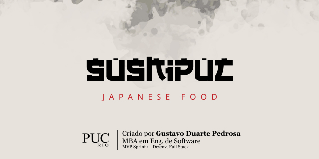

#
&nbsp;
&nbsp;


# Sobre o MVP
A aplicação consiste no projeto de conclusão de Sprint do MBA em Engenharia de Software pela PUC-Rio.

# Tecnologias
+ Python
+ Flask
+ OpenAPI
+ SQLite
+ SQLAlchemy
+ HTML5
+ CSS3
+ Bootstrap
+ JQuery

# Como executar?

A aplicação está dividida em 2 repositórios, sendo:
- [Back-end](https://github.com/gustavoduartep/pucrio-mvp-api)
- Front-end (Este repositório)

```powershell
# Acesse a pasta do da aplicação no terminal
$ cd pucrio-mvp-front

# Execute o arquivo index.html para abrir o front-end em seu browser
```

Em caso de dificuldades, por favor, entre em contato.